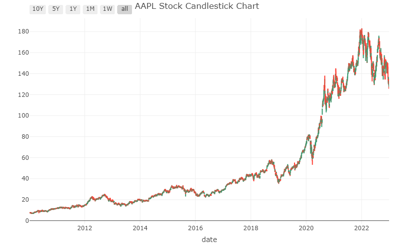
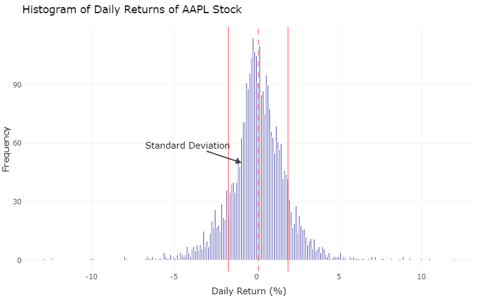

```{r setup, include=FALSE}
# include neccessary packages
knitr::opts_chunk$set(echo = TRUE)
#install.packages("dplyr")
library(dplyr)
#install.packages("ggplot2")
library(ggplot2)
#install.packages("tidyquant")
library(tidyquant)
#install.packages("lubridate")
library(lubridate)
#install.packages("plotly")
library(plotly)
#install.packages("gganimate")
library(gganimate)
#install.packages("gifski")
library(gifski)
```

## Question 1


This question analyses the stock performane of 14 big tech companies in dataset 1 and examines Apple Inc.'s stock (AAPL) as a potential long-term investment and assesses the inherent risks in its short-term fluctuations. The dataset crucial for this analysis includes AAPL's historical price trends, daily returns, and trading volumes, as detailed in the "AAPL_stock_data.csv". Understanding these aspects is fundamental in evaluating the stock's performance and market behavior over time. The interest in this question arises from Apple's significant role in the tech sector and its impact on investment portfolios, making it a focal point for both individual and institutional investors.

- **Stock Performance**: Investigating AAPL's historical price trends, daily returns, and trading volumes provides a thorough understanding of its performance. Recognizing patterns of growth and volatility is key to forecasting the stock's future movements.

- **Market Behavior**: The behavior of AAPL in the market can reveal insights into broader economic impacts, sector trends, and investor sentiments. It's important to grasp how external factors such as technological advancements, regulatory changes, and economic fluctuations affect AAPL.

- **Sector Influence**: As a leading entity in the tech industry, Apple's stock movements often mirror wider sector trends and can significantly sway market dynamics. This makes AAPL a key indicator of the health of the technology sector.

- **Investment Impact**: Apple's significant market capitalization means it plays a major role in many indices and investment funds, including the S&P 500 and various tech-focused portfolios. Its performance can dramatically influence these broader investment vehicles, making its analysis crucial for both individual and institutional investors.

- **Focal Point for Investors**: Given its size, influence, and performance, AAPL is at the center of investment strategies for a diverse group of market participants. Both individual investors and large institutions monitor Apple's financial health closely to inform their portfolio decisions and risk management strategies.

By exploring these aspects, investors and analysts can make informed decisions, strategically aligning their investment approaches with the opportunities and challenges presented by AAPL's presence in the market.
## Plotting the stock performance of 14 big tech companies
```{r, include = FALSE}
# Replace the path with the actual path to your CSV file
file_path <- "data/big_tech_stock_prices.csv"
# Read the CSV file into a data frame
data <- read.csv(file_path)
```

```{r, include = FALSE}

stock_data <- data

# Convert the 'date' column to an actual Date type if it's not already
stock_data$date <- as.Date(stock_data$date)

# Extract year from date
stock_data$year <- format(stock_data$date, "%Y")

# Group data by stock_symbol and year, and then summarize
annual_stock_summary <- stock_data %>%
  group_by(stock_symbol, year) %>%
  summarise(
    average_high = mean(high, na.rm = TRUE),
    average_low = mean(low, na.rm = TRUE),
    average_open = mean(open, na.rm = TRUE),
    average_close = mean(close, na.rm = TRUE),
    total_vol = sum(volume, na.rm = TRUE)
  ) %>%
  ungroup() 

```
```{r}
annual_stock_summary$year <- as.integer(annual_stock_summary$year)

p <- ggplot(
  annual_stock_summary, 
  aes(x = average_high, y=average_high, size = total_vol, colour = stock_symbol)
  ) +
  geom_point(show.legend = c(size = FALSE, color = TRUE), alpha = 0.7) +
  scale_color_viridis_d(option = "D") +
  scale_size(range = c(1, 28)) +
  scale_x_log10() +
  labs(x = "Average High", 
    y = "Average Low", 
    title = "Average High vs. Low Stock Prices for Big Tech Companies",
    subtitle = "Size based on total traded volume",
    legend = "Stock Symbol") +
  theme_minimal() + 
  theme(legend.position = "right")
p
```
```{r, include = FALSE}

p <- p +
  transition_time(year) + 
  labs(x = "Average High", 
    y = "Average Low", 
    title = "Average High vs. Low Stock Prices for Big Tech Companies in {frame_time}",
    subtitle = "Size based on total traded volume",
    legend = "Stock Symbol") + 
  theme(legend.position = "right")
animation <- animate(p, nframes = 14, fps = 3, width = 600, height = 400, renderer = gifski_renderer())

# Save the animation to a file
anim_save("img/stock_over_time_animation.gif", animation = animation)

```


**Key findings**
From the animated data visualization, we can see that Apple possessed the biggest volume of traded stock in the market, this motivates us to look deeper into this company to anaylyze its success in the stock market. Another insight is that the volumes of stock traded decreased from 2019, which makes us think that this has something related to the COVID-19 and is the inspiration behind our second questions.

### Choose Stock to Analyze Based on Volume Traded

The reason for us to choose 
```{r, include=FALSE}
# Replace the path with the actual path to your CSV file
file_path <- "data/big_tech_stock_prices.csv"

# Read the CSV file into a data frame
data <- read.csv(file_path)

# View the first few rows of the data frame
head(data)

```

```{r}
# Summing up the volume for each stock
volume_sum <- data %>%
  group_by(stock_symbol) %>%
  summarise(TotalVolume = sum(volume)) %>%
  arrange(desc(TotalVolume))

# Display the summed volumes
print(volume_sum)
```

```{r}
# Get the top 3 stock symbols
top_3_stocks <- head(volume_sum$stock_symbol, 3)

# Print the top 3 stock symbols
print(top_3_stocks)
```

```{r, include = FALSE}
# Loop through each top stock and save its data to a CSV file
for (stock in top_3_stocks) {
  stock_data <- data %>%
    filter(stock_symbol == stock) %>%
    select(-stock_symbol)
  
  # Construct file name and path
  file_name <- paste0(stock, "_stock_data.csv")
  file_path <- file.path("data/customed/", file_name) # Replace with your actual directory path
  
  # Save to CSV
  write.csv(stock_data, file_path, row.names = FALSE)
  
  # Print out file path for confirmation
  print(paste0("Data for ", stock, " saved to: ", file_path))
}
```


## Approach


### Scatter plot with trasition through time
  - **Purpose**: This plot aims to show the historical price trends of 14 big tech companies stock over the specified period.
   - **Design**: The plot features a scatter graph where the x-axis represents average low price of the year, and the y-axis represents the average high price of the year, the size of the scatter reflects the volume of stock traded.
   - **Utility**: By examining this plot, we can understand the behavior of companies through time.
  

### Time Series Plot of Adjusted Close Prices
   - **Purpose**: This plot aims to show the historical price trends of AAPL stock over the specified period. It provides a visual representation of the stock’s growth and any significant price fluctuations, which are essential for assessing its stability and performance over time. We also incorporate candle stick plot that is more suitable for stock data
   - **Design**: The plot features a line graph where the x-axis represents time (date), and the y-axis represents the adjusted close prices of AAPL stock. This straightforward visualization helps in observing the overall trend—whether it is an upward, downward, or cyclic pattern.
   - **Utility**: By examining this plot, investors can gauge the stock's long-term growth trajectory, identifying periods of strong performance as well as downturns. It’s useful for evaluating the resilience of AAPL as a long-term investment against market volatility.

### Histogram of Daily Returns with Color Mapping
   - **Purpose**: This plot analyzes the frequency and distribution of AAPL's daily returns. The goal is to illustrate the stock's daily volatility and risk profile by showing how often and how extensively its price changes within a single trading day.
   - **Design**: The histogram segments daily returns into bins, with the height of each bin indicating the frequency of those return values. Color mapping enhances this visualization: gains (positive returns) might be colored in green and losses (negative returns) in red, providing an immediate visual distinction between profitable and loss-making days.
   - **Utility**: Investors and analysts use this plot to understand the risk associated with short-term investments in AAPL. A broad distribution, especially with substantial tails, indicates higher volatility. This insight helps in making informed decisions about buying, holding, or selling the stock based on personal or institutional risk tolerance.

### Box Plot of Price Changes by Trading Volume Categories
   - **Purpose**: The aim of this plot is to explore the relationship between trading volumes and price changes, determining if larger volumes correlate with significant price movements.
   - **Design**: Trading days are categorized into quartiles based on trading volume (e.g., Low, Medium, High, Very High). A box plot for each category displays the spread and median of price changes on those days. This can include whiskers that extend to show the range, boxes indicating the interquartile range, and a line within the box showing the median value.
   - **Utility**: This plot allows for an examination of whether high trading volumes are associated with wider price swings, which might suggest that AAPL’s stock price is particularly sensitive to large trades. This correlation can indicate how news or market events impact the stock, providing a deeper understanding of its market behavior and potentially guiding trading strategies based on volume analysis.

## AAPL Stock Analysis

```{r}
# Load AAPL stock data
aapl_data <- read.csv("data/customed/AAPL_stock_data.csv")

# Convert date column to Date type
aapl_data$date <- as.Date(aapl_data$date)

# Display the structure and summary of the dataset
str(aapl_data)
summary(aapl_data)

# Check for null values
sum(is.na(aapl_data))
```
### Candle stick performance of Apple
```{r}
# Determine the global minimum low and maximum high values
global_min <- min(aapl_data$low, na.rm = TRUE)
global_max <- max(aapl_data$high, na.rm = TRUE)
fig <- aapl_data %>% plot_ly(x = ~date, type="candlestick",
          open = ~open, close = ~close,
          high = ~high, low = ~low) 
fig <- fig %>%  layout(title = "AAPL Stock Candlestick Chart",
         xaxis = list(
           type = "date",
           rangeslider = list(visible = F),
           rangeselector = list(
             buttons = list(
               list(count = 10, label = "10Y", step = "year", stepmode = "backward"),
               list(count = 5, label = "5Y", step = "year", stepmode = "backward"),
               list(count = 1, label = "1Y", step = "year", stepmode = "backward"),
               list(count = 1, label = "1M", step = "month", stepmode = "backward"),
               list(count = 1, label = "1W", step = "week", stepmode = "backward"),
               list(step = "all")
             )
           )
         )) %>%
         config(displayModeBar = TRUE, displaylogo = FALSE, modeBarButtonsToRemove = 
                c("autoScale2d", "toggleSpikelines", "zoomIn2d", "zoomOut2d", "select2d", "lasso2d"))
fig 
```

### AAPL Adjusted Close Price Over Time

```{r}
# Plotting the adjusted close price over time
ggplot(aapl_data, aes(x = date, y = adj_close)) +
  geom_line() +
  theme_minimal() +
  labs(title = "AAPL Stock Adjusted Close Price Over Time",
       x = "Date", y = "Adjusted Close Price")

```

The Adjusted Close Price graph of AAPL underscores a compelling growth narrative, supported by a comprehensive dataset spanning 3,271 trading days. This extensive period allows for a detailed analysis of the stock's performance, showcasing a notable upward trend indicative of strong market confidence and Apple's solid fundamentals.

### Statistical Insights
  - **Total Analyzed Period**: The data spans a significant timeframe, offering a robust foundation for analyzing trends.
  - **Growth Indicators**: The upward movement reflects Apple's resilience and growth, with the stock demonstrating a remarkable ability to recover from market fluctuations and maintain a positive trajectory.


### AAPL Daily Returns

```{r}
# Calculating daily returns
aapl_data <- aapl_data %>%
  arrange(date) %>%
  mutate(daily_return = (adj_close / lag(adj_close) - 1) * 100)

# Plotting daily returns
ggplot(aapl_data, aes(x = date, y = daily_return)) +
  geom_line() +
  theme_minimal() +
  labs(title = "Daily Returns of AAPL Stock",
       x = "Date", y = "Daily Return (%)")
```
```{r}
library(ggplot2)
library(dplyr)
library(plotly)
# Assuming 'aapl_data' already has 'daily_return' calculated and is ordered by date
# Calculate mean and standard deviation
mean_return <- mean(aapl_data$daily_return, na.rm = TRUE)
std_dev <- sd(aapl_data$daily_return, na.rm = TRUE)
# Create a ggplot histogram
p <- ggplot(aapl_data, aes(x = daily_return)) +
  geom_histogram(binwidth = 0.1, fill = "darkblue", color = "white") +
  geom_vline(xintercept = mean_return, color = "red", linetype = "dashed", size = 0.2) +
  geom_vline(xintercept = mean_return + std_dev, color = "red", linetype = "solid", size = 0.2) +
  geom_vline(xintercept = mean_return - std_dev, color = "red", linetype = "solid", size = 0.2) +
  labs(title = "Histogram of Daily Returns of AAPL Stock",
       x = "Daily Return (%)", y = "Frequency") +
  theme_minimal() 
  
# Convert the ggplot object to a plotly object
fig <- ggplotly(p)
# Add hover text for standard deviation lines
fig <- fig %>% 
  
  layout(annotations = list(
  list(x = mean_return - 1, y = 50, text = "Standard Deviation", showarrow = TRUE, arrowhead = 2, ax = -90)
))
fig 
```


The Daily Returns graph provides a clear depiction of AAPL's volatility, characterized by fluctuations around a central tendency with occasional spikes. This volatility is a testament to the dynamic nature of the stock market and Apple's sensitivity to market sentiments and news.

### Statistical Highlights
  - **Positive vs. Negative Days**: With 1,721 days (52.61%) recording positive returns and 1,544 days (47.20%) showing negative returns, the data highlights a slightly higher tendency towards positive movements, albeit with substantial variability.
  - **Volatility Measurement**: The standard deviation of daily returns stands at approximately 1.81%, emphasizing the stock's short-term volatility. The range of daily returns, from a maximum of 11.98% to a minimum of -12.86%, further underlines the potential for significant price swings within a single trading day.
  
### Trend Distribution of AAPL Daily Returns

```{r}
# Defining trend categories based on daily returns
aapl_data$trend <- with(aapl_data, case_when(
  daily_return <= 0.5 & daily_return >= -0.5 ~ "Slight or No change",
  daily_return > 0.5 & daily_return <= 1 ~ "Slight Positive",
  daily_return < -0.5 & daily_return >= -1 ~ "Slight Negative",
  daily_return > 1 & daily_return <= 5 ~ "Positive",
  daily_return < -1 & daily_return >= -5 ~ "Negative",
  daily_return > 5 ~ "Extremely Positive",
  daily_return < -5 ~ "Extremely Negative"
))

# Plotting trend distribution
aapl_data %>%
  group_by(trend) %>%
  summarise(count = n()) %>%
  ggplot(aes(x = reorder(trend, -count), y = count, fill = trend)) +
  geom_bar(stat = "identity") +
  theme_minimal() +
  labs(title = "Trend Distribution of AAPL Daily Returns",
       x = "Trend", y = "Count") +
  coord_flip()

```

The trend distribution offers a nuanced view of AAPL's daily return patterns, categorizing days into various trends based on the magnitude of price changes. This segmentation reveals the predominance of days with 'Slight or No change', highlighting an underlying stability amidst volatility. Moreover, comparing between positive and negative of each type, we can clearly see that positive out perform negative in each segmentation, which will ultimately translate into profit in long term.

### Statistical Insights
  - **Trend Distribution**: Approximately 30.03% of the days witnessed 'Slight or No change', indicating stability on a significant portion of trading days. The presence of 'Positive' (26.33%) and 'Negative' (20.31%) days illustrates the stock's capacity for notable price movements, providing opportunities for strategic trading.

## Conclusion

The time series plot shows a general upward trend in AAPL's stock price, supporting its consideration as a viable long-term investment. However, this plot might also reveal periods of volatility during market downturns or economic uncertainty, highlighting potential risks that need to be managed.

The histogram of daily returns will likely demonstrate AAPL's short-term trading risks. A wide spread in the distribution of returns, especially if skewing towards negative outcomes, could indicate higher volatility, which is often seen in tech stocks influenced by market sentiments and external economic factors.

### Key Takeaways for Investors
  - **Long-term Growth**: AAPL shows promising growth prospects, supported by its historical price increases.
  - **Short-term Volatility**: Investors must navigate short-term volatility, evident in daily returns and volume spikes, which reflect the stock's sensitivity to market sentiments and news.
  - **Informed Decision-Making**: A strategic approach, leveraging insights from trading volumes and price trends, can help in capitalizing on opportunities and managing risks.

Together, these plots will provide a dual perspective on AAPL's investment profile. If the long-term trend is strong but accompanied by significant short-term fluctuations, the stock may be more suited to investors who can tolerate volatility or those employing strategies that leverage these movements. Conversely, a more stable long-term trend accompanied by moderate daily fluctuations would appeal to conservative investors seeking growth with manageable risks.

By analyzing these trends, investors and analysts can better understand the conditions under which AAPL thrives and the potential challenges it faces, facilitating more informed decision-making regarding portfolio inclusion and investment strategy.

