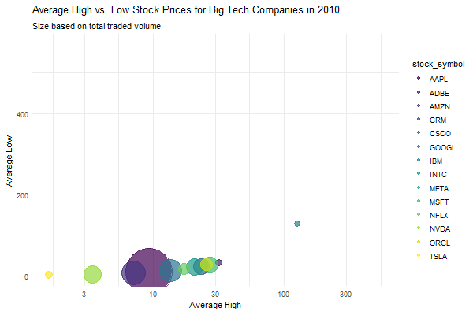

```{r setup, include=FALSE}
knitr::opts_chunk$set(echo = TRUE)
#install.packages("dplyr")
library(dplyr)
#install.packages("ggplot2")
library(ggplot2)
#install.packages("tidyquant")
library(tidyquant)
#install.packages("lubridate")
library(lubridate)
#install.packages("plotly")
library(plotly)
#install.packages("gganimate")
library(gganimate)
#install.packages("gifski")
library(gifski)
```

## Choose Stock to Analyze Based on Volume Traded

```{r}
# Replace the path with the actual path to your CSV file
file_path <- "data/big_tech_stock_prices.csv"

# Read the CSV file into a data frame
data <- read.csv(file_path)

# View the first few rows of the data frame
head(data)

```
```{r}

stock_data <- data

# Convert the 'date' column to an actual Date type if it's not already
stock_data$date <- as.Date(stock_data$date)

# Extract year from date
stock_data$year <- format(stock_data$date, "%Y")

# Group data by stock_symbol and year, and then summarize
annual_stock_summary <- stock_data %>%
  group_by(stock_symbol, year) %>%
  summarise(
    average_high = mean(high, na.rm = TRUE),
    average_low = mean(low, na.rm = TRUE),
    average_open = mean(open, na.rm = TRUE),
    average_close = mean(close, na.rm = TRUE),
    total_vol = sum(volume, na.rm = TRUE)
  ) %>%
  ungroup() 

```
```{r}
annual_stock_summary$year <- as.integer(annual_stock_summary$year)

p <- ggplot(
  annual_stock_summary, 
  aes(x = average_high, y=average_high, size = total_vol, colour = stock_symbol)
  ) +
  geom_point(show.legend = c(size = FALSE, color = TRUE), alpha = 0.7) +
  scale_color_viridis_d(option = "D") +
  scale_size(range = c(1, 28)) +
  scale_x_log10() +
  labs(x = "Average High", 
    y = "Average Low", 
    title = "Average High vs. Low Stock Prices for Big Tech Companies",
    subtitle = "Size based on total traded volume",
    legend = "Stock Symbol") +
  theme_minimal() + 
  theme(legend.position = "right")
p
```

```{r}

p <- p +
  transition_time(year) + 
  labs(x = "Average High", 
    y = "Average Low", 
    title = "Average High vs. Low Stock Prices for Big Tech Companies in {frame_time}",
    subtitle = "Size based on total traded volume",
    legend = "Stock Symbol") + 
  theme(legend.position = "right")
animation <- animate(p, nframes = 14, fps = 3, width = 600, height = 400, renderer = gifski_renderer())

# Save the animation to a file
anim_save("img/stock_over_time_animation.gif", animation = animation)

```

```{r}
# Summing up the volume for each stock
volume_sum <- data %>%
  group_by(stock_symbol) %>%
  summarise(TotalVolume = sum(volume)) %>%
  arrange(desc(TotalVolume))

# Display the summed volumes
print(volume_sum)
```

```{r}
# Get the top 3 stock symbols
top_3_stocks <- head(volume_sum$stock_symbol, 3)

# Print the top 3 stock symbols
print(top_3_stocks)
```

```{r}
# Loop through each top stock and save its data to a CSV file
for (stock in top_3_stocks) {
  stock_data <- data %>%
    filter(stock_symbol == stock) %>%
    select(-stock_symbol)
  
  # Construct file name and path
  file_name <- paste0(stock, "_stock_data.csv")
  file_path <- file.path("data/customed", file_name) # Replace with your actual directory path
  
  # Save to CSV
  write.csv(stock_data, file_path, row.names = FALSE)
  
  # Print out file path for confirmation
  print(paste0("Data for ", stock, " saved to: ", file_path))
}
```

```{r}
# Loop through each top stock and save its data to a CSV file
for (stock in bottom_3_stocks) {
  stock_data <- data %>%
    filter(stock_symbol == stock) %>%
    select(-stock_symbol)
  
  # Construct file name and path
  file_name <- paste0(stock, "_stock_data.csv")
  file_path <- file.path("data/customed", file_name) # Replace with your actual directory path
  
  # Save to CSV
  write.csv(stock_data, file_path, row.names = FALSE)
  
  # Print out file path for confirmation
  print(paste0("Data for ", stock, " saved to: ", file_path))
}
```


## AAPL Stock Analysis

```{r}
# Load AAPL stock data
aapl_data <- read.csv("data/customed/ADBE_stock_data.csv")

# Convert date column to Date type
aapl_data$date <- as.Date(aapl_data$date)

# Display the structure and summary of the dataset
str(aapl_data)
summary(aapl_data)

# Check for null values
sum(is.na(aapl_data))
```
### AAPL Adjusted Close Price Over Time


```{r}

# Determine the global minimum low and maximum high values
global_min <- min(aapl_data$low, na.rm = TRUE)
global_max <- max(aapl_data$high, na.rm = TRUE)

fig <- aapl_data %>% plot_ly(x = ~date, type="candlestick",
          open = ~open, close = ~close,
          high = ~high, low = ~low) 

fig <- fig %>%  layout(title = "AAPL Stock Candlestick Chart",
         xaxis = list(
           type = "date",
           rangeslider = list(visible = F),
           rangeselector = list(
             buttons = list(
               list(count = 10, label = "10Y", step = "year", stepmode = "backward"),
               list(count = 5, label = "5Y", step = "year", stepmode = "backward"),
               list(count = 1, label = "1Y", step = "year", stepmode = "backward"),
               list(count = 1, label = "1M", step = "month", stepmode = "backward"),
               list(count = 1, label = "1W", step = "week", stepmode = "backward"),
               list(step = "all")
             )
           )
         )) %>%
         config(displayModeBar = TRUE, displaylogo = FALSE, modeBarButtonsToRemove = 
                c("autoScale2d", "toggleSpikelines", "zoomIn2d", "zoomOut2d", "select2d", "lasso2d"))


fig 

```


The Adjusted Close Price graph of AAPL underscores a compelling growth narrative, supported by a comprehensive dataset spanning 3,271 trading days. This extensive period allows for a detailed analysis of the stock's performance, showcasing a notable upward trend indicative of strong market confidence and Apple's solid fundamentals.

- **Statistical Insights**:
  - **Total Analyzed Period**: The data spans a significant timeframe, offering a robust foundation for analyzing trends.
  - **Growth Indicators**: The upward movement reflects Apple's resilience and growth, with the stock demonstrating a remarkable ability to recover from market fluctuations and maintain a positive trajectory.


### AAPL Daily Returns

```{r}
# Calculating daily returns
aapl_data <- aapl_data %>%
  arrange(date) %>%
  mutate(daily_return = (adj_close / lag(adj_close) - 1) * 100)

# Plotting daily returns
ggplot(aapl_data, aes(x = date, y = daily_return)) +
  geom_line() +
  theme_minimal() +
  labs(title = "Daily Returns of AAPL Stock",
       x = "Date", y = "Daily Return (%)")
```


```{r}
library(ggplot2)
library(dplyr)
library(plotly)

# Assuming 'aapl_data' already has 'daily_return' calculated and is ordered by date

# Calculate mean and standard deviation
mean_return <- mean(aapl_data$daily_return, na.rm = TRUE)
std_dev <- sd(aapl_data$daily_return, na.rm = TRUE)

# Create a ggplot histogram
p <- ggplot(aapl_data, aes(x = daily_return)) +
  geom_histogram(binwidth = 0.1, fill = "darkblue", color = "darkblue") +
  geom_vline(xintercept = mean_return, color = "red", linetype = "dashed", linewidth = 0.2) +
  geom_vline(xintercept = mean_return + std_dev, color = "red", linetype = "solid", linewidth = 0.2) +
  geom_vline(xintercept = mean_return - std_dev, color = "red", linetype = "solid", linewidth = 0.2) +
  labs(title = "Histogram of Daily Returns of AAPL Stock",
       x = "Daily Return (%)", y = "Frequency") +
  theme_minimal() 
  

# Convert the ggplot object to a plotly object
fig <- ggplotly(p)

# Add hover text for standard deviation lines
fig <- fig %>% 
  
  layout(annotations = list(
  list(x = mean_return - 1.5, y = 50, text = "Standard Deviation", showarrow = TRUE, arrowhead = 2, ax = -90)
))

fig 

```
The Daily Returns graph provides a clear depiction of AAPL's volatility, characterized by fluctuations around a central tendency with occasional spikes. This volatility is a testament to the dynamic nature of the stock market and Apple's sensitivity to market sentiments and news.

- **Statistical Highlights**:
  - **Positive vs. Negative Days**: With 1,721 days (52.61%) recording positive returns and 1,544 days (47.20%) showing negative returns, the data highlights a slightly higher tendency towards positive movements, albeit with substantial variability.
  - **Volatility Measurement**: The standard deviation of daily returns stands at approximately 1.81%, emphasizing the stock's short-term volatility. The range of daily returns, from a maximum of 11.98% to a minimum of -12.86%, further underlines the potential for significant price swings within a single trading day.
  
### Trend Distribution of AAPL Daily Returns

```{r}
# Defining trend categories based on daily returns
aapl_data$trend <- with(aapl_data, case_when(
  daily_return <= 0.5 & daily_return >= -0.5 ~ "Slight or No change",
  daily_return > 0.5 & daily_return <= 1 ~ "Slight Positive",
  daily_return < -0.5 & daily_return >= -1 ~ "Slight Negative",
  daily_return > 1 & daily_return <= 5 ~ "Positive",
  daily_return < -1 & daily_return >= -5 ~ "Negative",
  daily_return > 5 ~ "Extremely Positive",
  daily_return < -5 ~ "Extremely Negative"
))

# Plotting trend distribution
aapl_data %>%
  group_by(trend) %>%
  summarise(count = n()) %>%
  ggplot(aes(x = reorder(trend, -count), y = count, fill = trend)) +
  geom_bar(stat = "identity") +
  theme_minimal() +
  labs(title = "Trend Distribution of AAPL Daily Returns",
       x = "Trend", y = "Count") +
  coord_flip()

```

The trend distribution offers a nuanced view of AAPL's daily return patterns, categorizing days into various trends based on the magnitude of price changes. This segmentation reveals the predominance of days with 'Slight or No change', highlighting an underlying stability amidst volatility.

- **Statistical Insights**:
  - **Trend Distribution**: Approximately 30.03% of the days witnessed 'Slight or No change', indicating stability on a significant portion of trading days. The presence of 'Positive' (26.33%) and 'Negative' (20.31%) days illustrates the stock's capacity for notable price movements, providing opportunities for strategic trading.

## Conclusion
  
AAPL's historical price trends, daily returns, and trading volumes illustrate a stock characterized by robust long-term growth and notable short-term volatility. The upward trend in adjusted close prices signals strong investor confidence and growth potential, making AAPL an attractive option for long-term investors. However, the significant day-to-day price fluctuations underscore the stock's volatility, presenting both opportunities and risks.

**Key Takeaways for Investors**:
- **Long-term Growth**: AAPL shows promising growth prospects, supported by its historical price increases.
- **Short-term Volatility**: Investors must navigate short-term volatility, evident in daily returns and volume spikes, which reflect the stock's sensitivity to market sentiments and news.
- **Informed Decision-Making**: A strategic approach, leveraging insights from trading volumes and price trends, can help in capitalizing on opportunities and managing risks.

In essence, while AAPL offers substantial growth potential, it also demands careful consideration of its volatility. Investors looking to benefit from AAPL's market position should prepare for the inherent risks, adopting strategies that balance the pursuit of growth with risk management.
