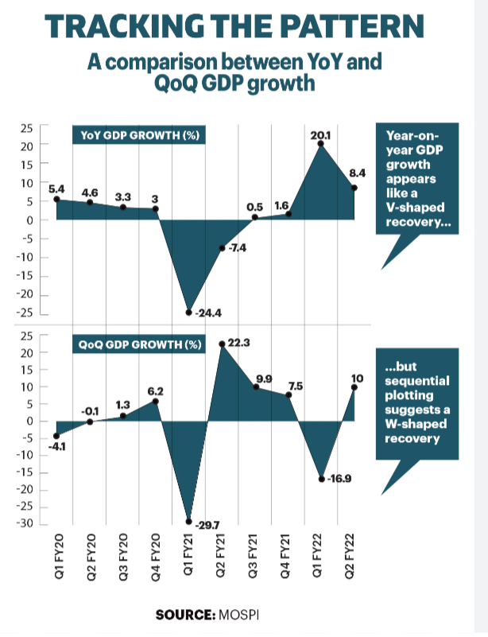

# Big Tech Stock Prices Dataset Overview

## Dataset Description

The dataset, named **Big Tech Stock Prices**, was uploaded to the TidyTuesday repository on February 7th, 2023. It is sourced from Yahoo Finance via Kaggle, courtesy of Evan Gower. This dataset comprises daily stock prices and volume for 14 different tech companies.

## Data Dictionary

There are 2 main CSV files in this dataset:

### `big_tech_stock_prices.csv`

This file contains detailed daily stock prices (open price, close price, etc.) for each of the 14 companies across several years, with the following variables:

| Variable    | Class     | Description                                                                                                                                                                                                                        |
|-------------|-----------|------------------------------------------------------------------------------------------------------------------------------------------------------------------------------------------------------------------------------------|
| stock_symbol| character | The stock symbol of the company.                                                                                                                                                                                                   |
| date        | double    | The date on which the stock data was recorded.                                                                                                                                                                                     |
| open        | double    | The price of the stock at the market open.                                                                                                                                                                                         |
| high        | double    | The highest price of the stock on that day.                                                                                                                                                                                        |
| low         | double    | The lowest price of the stock on that day.                                                                                                                                                                                         |
| close       | double    | The closing price of the stock, adjusted for splits.                                                                                                                                                                               |
| adj_close   | double    | The closing price after adjustments for splits and dividend distributions, adhering to CRSP standards.                                                                                                                              |
| volume      | double    | The number of shares traded on that day.                                                                                                                                                                                           |

### `big_tech_companies.csv`

This file maps the stock symbols to company names and contains 14 samples, one for each company included in the study. The file includes 45,089 samples (3721 for each company except Tesla and Meta because they were not publicly traded for part of the period examined, however, those missing samples' influences are not significant because the other are still contiguous and experimentable ). 

| Variable    | Class     | Description                  |
|-------------|-----------|------------------------------|
| stock_symbol| character | The stock symbol of the company. |
| company     | character | The full name of the company.    |

## Motivation

The dataset is highly valuable for several reasons:

- **Richness of Samples**: With approximately 45,000 samples, it meets all the requirements for project 1 (being new, containing both numerical and categorical features), and can generalize the distribution of features. It also offers insights into data preprocessing due to the large number of samples.
- **Interesting Patterns in Stock Prices**: Given the fluctuating nature of stock prices, visualizing this dataset can reveal patterns and rules in stock price changes.
- **Multiple Purposes**: This dataset has broad applications, such as predictive machine learning models, making it a versatile resource beyond just this project.

## Questions to Answer

### Long-Term Investment Potential and Short-Term Risks of AAPL Stock

**Question**: How do AAPL's historical price trends, daily returns, and trading volumes illustrate its potential as a stock for long-term investment and its inherent short-term risks?

**Why**: This analysis seeks to understand the dual aspects of AAPL's stock performance: its potential for long-term growth and its susceptibility to short-term market fluctuations. Investigating these elements is essential for investors looking to balance growth opportunities with risk management in their portfolios.

**Plan for Question**:

- **Variables Involved**:
  - `date`, `adj_close`, `volume` (double): These variables are key for analyzing the stock's adjusted closing prices over time and daily trading volumes, essential for assessing market activity and price stability.
  - `daily_return` (double): Calculated from price changes between consecutive days to gauge day-to-day volatility.

- **Variables to be Created**:
  - `price_change`: The difference in adjusted close price from one day to the next, providing insight into daily price movements.
  - `volume_category`: A categorical variable dividing trading days into quartiles based on volume, used to analyze the impact of trading volume on price volatility.

- **External Data**:
  - Economic indicators that could affect stock performance (e.g., interest rate changes, GDP growth rates).
  - Major product release dates and other significant corporate events at Apple.

- **Analysis Plan**:
  1. Compile and preprocess the data to include necessary variables and time frames.
  2. Create a time-series plot to visualize long-term price trends and highlight any significant fluctuations.
  3. Generate a histogram of daily returns to assess the frequency and range of daily price changes, using color coding to distinguish between gains and losses.
  4. Construct a box plot to examine the relationship between trading volumes and daily price changes, categorizing days by volume intensity.
  5. Integrate external data to correlate stock performance changes with specific economic events or corporate announcements.
  6. Use detailed visualizations, such as scatter plots and box plots, to provide a comprehensive view of the stock's performance dynamics.

By following this structured approach, the analysis will deliver valuable insights into AAPL's viability as a long-term investment and the risks involved in short-term trading, helping investors make informed decisions.

### Comparative Growth Analysis Since a Key Historical Event

**Question**: How have the stock prices of tech giants recovered and grown since the COVID-19 pandemic outbreak, and how do their recoveries compare?

**Why**: This analysis is pertinent due to the significant impact of recent global events on markets, providing insights into the resilience and growth potential of big tech companies.

**Plan for Question 2**:

- **Variables Involved**:
  - `stock_symbol`, `date`, `close` (double): For identifying companies and analyzing closing prices post-pandemic.

- **Variables to be Created**:
  indexed_price: Calculated by setting the stock price on the first day of the pandemic as the base (index 100) and then calculating each subsequent day's price as a percentage of this base value. This enables a direct comparison of stock prices indexed at the pandemic's start.

- **External Data**:
  - Major economic indicators and policy change dates. To be specific, we are thinking of adding the GDP of the whole country to compare with the companies.

- **Analysis Plan**:
  1. Filter for companies from the start of the pandemic.
  2. Normalize stock prices
  3. Calculate the time it took for each company to recover to pre-pandemic stock prices.
  4. Plot an area chart with negative indexes to compare the recovery and growth post-pandemic. Charts would be similar to the chart in the following picture.
  
  5. Merge external data to add context to the recovery period.
  6. Annotate the chart to highlight significant recovery milestones and phases of growth.

